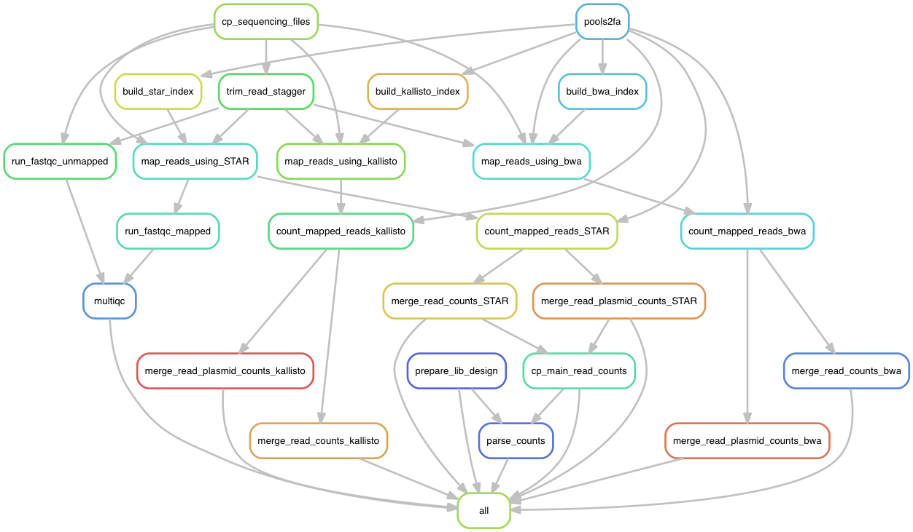

Mapping paired ends sequencing reads to get oligo counts

Snakefile requires a configuration file as input.
The config file points to samples file (see examples).

The samples tables required columns are:

sample_index
induction_time
induction_time_index
induction_generation
induction_replicate
competition_time
competition_time_index
competition_generation
competition_replicate
competition_medium
cell_num_start
cell_num_end
growth_ratio
OD
Sequencing_reads_R1
Sequencing_reads_R2
Column order is not felxible and the table can contain any additional columns

We found that raw reads mapped by STAR with zero mismatch parameter give good performances.

# Snakemake workflow rules graph

